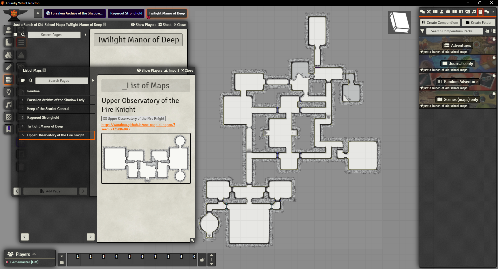

# Just a Bunch of Old-School Maps

## How to install

Install manually the latest build by pasting this manifest url: 

This module includes a bunch of Old-School maps generated by Watabou's Procgen Arcana. Each is fully walled and has a specific journal entry linked to it. 
* I put a big map pin in the padding around the map linking to its journal entry. I find it easier this way, but you can erase it. The journal is also linked to the map as *scene notes*, in the *ambience* scene setting, so you can access it by right-clicking the scene name.
* No description is provided. The name was generated by Procgen Arcana. Use it as inspiration or discard it as you see fit.
* The scenes and journals alone are also included, in case you do not want them together. 
* A random table including all the adventures is provided, so you do not have to choose yourself!
* A list of all maps is included as a Journal Entry, so you can easily browse and import the ones you want, straight from your Foundry interface.
* The unique url from Procgen Arcana is provided. This way, you can go there, modify the map, export it as a png (100 px per square) and use it as the background image for the scene. All the walls and doors will still line up.

Thank you!

Jordan — Abacus Tabletop Games

## Required and Recommended Modules

### Recommended

* My own [Old-School Map Symbols](https://github.com/Jordan-Abacus/old-school-map-symbols), so you can add statues, dais and other things on the map.
* [Automatic Journal Icon Numbers](https://foundryvtt.com/packages/journal-icon-numbers), by ChrisF. It creates a numbered map pin automatically when the title of the Journal entry starts with a number, amongst other things.

## Jordan — Abacus Tabletop Games

[Website](https://abacustabletopgames.bearblog.dev/)  
[Email](abacus.tabletop.games@gmail.com)

## Attributions, etc.

* The maps were generated using [Watabou's Procgen Arcana](https://watabou.github.io/index.html).